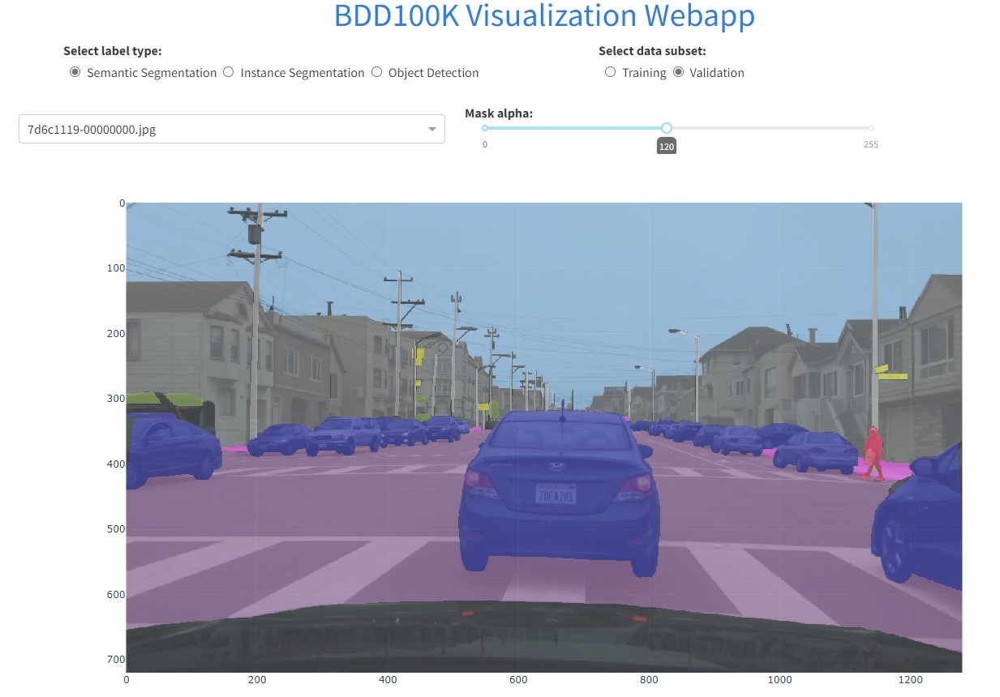

# bdd100k Visualization Tool

bdd100k_vis is a Dash-Plotly GUI application that provides visualizations for the Berkley Deep Drive Dataset [bdd100k](https://github.com/bdd100k/bdd100k).


### Main Features:
* Browse and view images
* Semantic/instance segmentation visualization:
  * Overlay using dynamic alpha composite (user adjustable)
* Object detection visualization:
  * Draw bounding boxes from JSON labels file
* Legend for object colors


## Usage
Clone this repo, and run the python script from the repo directory:

```
git clone doronser/bdd100k_visualize

cd bdd100k_visualize

python bdd100k_vis.py

http://127.0.0.1:8050/
```

## Data Setup

This repo includes a dummy dataset to demonstrante the capabilities of the tool using several images. If you want to get the entire dataset, it can downloaded [here](https://bdd-data.berkeley.edu/). The parts of the dataset supported by this tool are:

* 100k images
* 10k images
* Detection 2020 Labels
* Semantic Segmentation
* Instance Sementation

See bddk100k [documentation](https://doc.bdd100k.com/download.html) for more information.

Once you have the dataset, modify bdd100k_vis.py to include the path to the dataset like so:

```
 app = bdd100k_vis('path/to/dataset/bdd100k')
```

## Screenshots

Object Detection:


Instance Segmentation:


Semantic Segmentation:




## License
[MIT Open Source](https://choosealicense.com/licenses/mit/)

Feel free to use this work as long as you refrence this repo.

Contact: doronser@gmail.com
